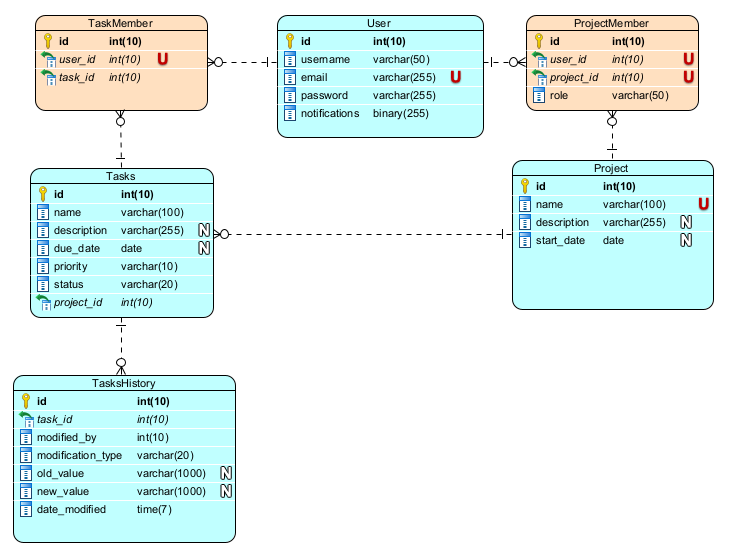
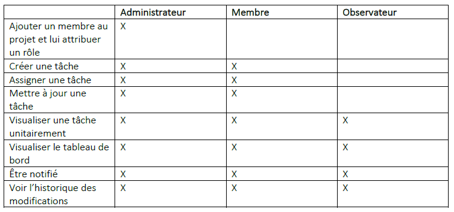

# PMT Project Management Tool

## Description
PMT est une plateforme de gestion de projet collaboratif destinée aux équipes de développement logiciel.
L’application permettra aux équipes de planifier, suivre et collaborer sur des projets de manière efficace.

## Architecture

Tous les composants de l'application sont conteneurisés à l'aide de Docker.
Cela permet de garantir que l'application fonctionne de la même manière sur tous les environnements.
Cela facilite également le déploiement et l'exécution de l'application.

### Frontend
Le frontend de l'application est développé en utilisant le framework Angular.

### Backend
Le backend de l'application est développé en utilisant le framework Spring Boot.

### Base de données
La base de données utilisée est MySQL. (une base in memory H2 est utilisé pour les tests et la phase de développement)

Le modèle de la base de données est le suivant :



## Fonctionnalités

Les fonctionnalités de l'application sont les suivantes :

- En tant que visiteur, je veux pouvoir m'inscrire avec un nom d’utilisateur, une adresse e-mail et un mot de passe afin d’avoir un compte sur la plateforme.
- En tant qu’inscrit, je veux pouvoir me connecter à la plateforme avec mon adresse e-mail et mon mot de passe afin de pouvoir accéder à mon espace.
- En tant qu'utilisateur, je veux pouvoir créer un nouveau projet avec un nom, une description et une date de début afin d’être un administrateur du projet.
- En tant qu'administrateur d’un projet, je veux pouvoir inviter d'autres membres à rejoindre mon projet en saisissant leur adresse e-mail afin de partager le projet.
- En tant qu’administrateur d’un projet, je veux pouvoir attribuer des rôles aux membres du projet (administrateur, membre, observateur) afin de définir leurs permissions.
- En tant qu'administrateur ou membre d’un projet, je veux pouvoir créer des tâches pour mon projet avec un nom, une description, une date d'échéance et une priorité.
- En tant qu'administrateur ou membre, je veux pouvoir assigner des tâches à des membres spécifiques du projet.
- En tant qu’administrateur ou membre, je veux pouvoir mettre à jour une tâche afin de changer n’importe quelle information ou ajouter une date de fin.
- En tant qu’administrateur, membre ou observateur, je veux pouvoir visualiser une tâche unitaire afin d’en voir toutes les informations.
- En tant qu’administrateur, membre ou observateur, je veux pouvoir visualiser les tâches selon les statuts afin de suivre l'avancement des tâches sur un tableau de bord.
- En tant qu’administrateur, membre ou observateur, je veux pouvoir recevoir des notifications par e-mail lorsqu'une tâche est assignée.
- En tant qu’administrateur, membre ou observateur, je veux pouvoir suivre l'historique des modifications apportées aux tâches.

Voici un résumé des permissions en fonction des rôles:



## Documentation

### JavaDoc 

- La documentation JavaDoc du projet est disponible dans le dossier `backend/doc/`

### Swagger UI

- Une documentation dynamique OpenAPI au format Swagger est disponible à l'adresse suivante, une fois l'application démarrée sur votre poste : `http://localhost:8081/swagger-ui.html`

## Procédure de build / validation

- Github Actions a été utilisé pour la CI/CD du projet.
- Les étapes de build et de validation sont disponibles dans le fichier `.github/workflows/ci.yml`, elles incluent:
  - compilation du code Java
  - exécution des tests unitaires
  - compilation du code Angular
  - exécution des tests unitaires Angular
  - création des images Docker via `docker-compose`
  - run des tests au niveau système :
    - réponse de l'api, de l'interface, de la base de données, de l'interface swagger
  - push des images Docker sur le Docker Hub

- La CI est déclenchée automatiquement lors du push dans le dépôt Github.
- Pour déclencher un build en local, il suffit de lancer la commande suivante à la racine du projet:

```bash
docker-compose build
```

## Procédure de déploiement

- Le déploiement est automatisé grâce à l'usage de docker-compose. Il suffit de lancer la commande suivante pour démarrer l'application sur votre poste/un serveur de production:

```bash
docker-compose up --no-build
```


